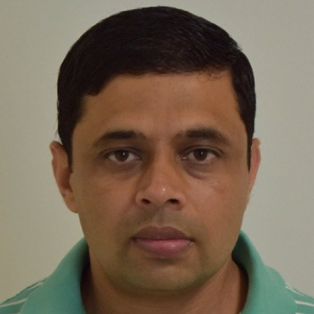

```{=html}
<div class="eyebrow">Advisors &amp; collaborators</div>
```

Three faculty advisors have shaped Khanal's research development across his
bachelor's, master's, and doctoral training: Dr. Ujjal Tiwari at Agriculture and
Forestry University, Dr. Courtney Bir during the master's degree, and Dr. Dayton
Lambert at the doctoral level.

```{=html}
<div class="person">
  <div>
    
    <div class="person__caption">With Dr. Dayton Lambert, SAEA Annual Meeting, Louisville, Kentucky, 2026.</div>
  </div>
  <div>
    <h2 class="person__name">Dr. Dayton Lambert</h2>
    <div class="person__role">Doctoral advisor &middot; Sparks Chair in Agricultural Sciences</div>
    <p>
      Khanal works under Dr. Dayton Lambert, Sparks Chair in Agricultural
      Sciences at Oklahoma State University, on a Hierarchical Spatial
      Errors-in-Variables Model (HSEVM) for crop yield estimation. The project
      jointly estimates kriged interpolation surfaces for climate variables
      alongside county-level yield regressions, using Bayesian inference through
      the Integrated Nested Laplace Approximation (INLA). Lambert has directed
      key modeling decisions on the project, including the use of county
      centroid polynomial coordinates as instruments to address the Modifiable
      Areal Unit Problem and spatial support misalignment between weather
      stations and county boundaries.
    </p>
  </div>
</div>
```

```{=html}
<div class="person">
  <div>
    
    <div class="person__caption">With Dr. Courtney Bir, Master's thesis defense, Oklahoma State University, March 2025.</div>
  </div>
  <div>
    <h2 class="person__name">Dr. Courtney Bir</h2>
    <div class="person__role">Master's advisor &middot; Associate Professor of Agricultural Economics</div>
    <p>
      During his Master's degree, Khanal worked under Dr. Courtney Bir,
      Associate Professor of Agricultural Economics at Oklahoma State
      University. His thesis examined the economic feasibility of wine grape and
      vine production in the Southern Great Plains region of Oklahoma,
      evaluating establishment costs, yield expectations, and breakeven
      economics for prospective growers. That work developed into the manuscript
      "Economic Feasibility of Wine Grape Cultivation in the Southern Great
      Plains," coauthored with Bir and Aaron Essary, currently under review at
      the <em>Journal of Agricultural and Applied Economics</em>.
    </p>
  </div>
</div>
```

```{=html}
<div class="person">
  <div>
    
    <div class="person__caption">Bachelor's thesis advisor, Agriculture and Forestry University, Nepal.</div>
  </div>
  <div>
    <h2 class="person__name">Dr. Ujjal Tiwari</h2>
    <div class="person__role">Bachelor's thesis advisor &middot; Assistant Professor<br>Deputy Director, Directorate of Research and Extension (DoREX)</div>
    <p>
      Khanal completed his bachelor's thesis under the supervision of Dr. Ujjal
      Tiwari in the Department of Agricultural Economics and Agribusiness
      Management at Agriculture and Forestry University, Nepal. The research
      examined dairy farmers' willingness to adopt cattle insurance and the
      amount they were willing to pay for coverage in Dang, Nepal. Using survey
      data from 150 dairy farmers and a double-hurdle model, the study evaluated
      how socioeconomic, farm, institutional, and risk-related factors
      influenced both insurance participation and premium decisions. The thesis
      later contributed to the peer-reviewed article "Willingness to Pay for
      Cattle Insurance in Nepal: A Double-Hurdle Model Perspective," published
      in 2024.
    </p>
    <ul class="pub-list">
      <li class="pub">
        <div class="pub__year">2024</div>
        <div>
          <p class="pub__title">Willingness to pay for cattle insurance in Nepal: a double-hurdle model perspective</p>
          <p class="pub__meta">Khanal, S., Tiwari, U., &amp; Khanal, S.<br><em>Global Journal of Agricultural and Allied Sciences, 5(1), 7&ndash;14</em><br><a class="pub__doi" href="https://doi.org/10.35251/gjaas.2024.002">10.35251/gjaas.2024.002</a></p>
        </div>
        <div class="pub__tag">Published</div>
      </li>
    </ul>
  </div>
</div>
```

```{=html}
<div class="section-head">
  <div class="eyebrow">Milestone</div>
  <h2>Master's degree conferred</h2>
</div>
```

```{=html}
<div class="gallery">
  
  
</div>
```

[Read the research](research.qmd) &nbsp;·&nbsp;
[Conferences](conferences.qmd)
