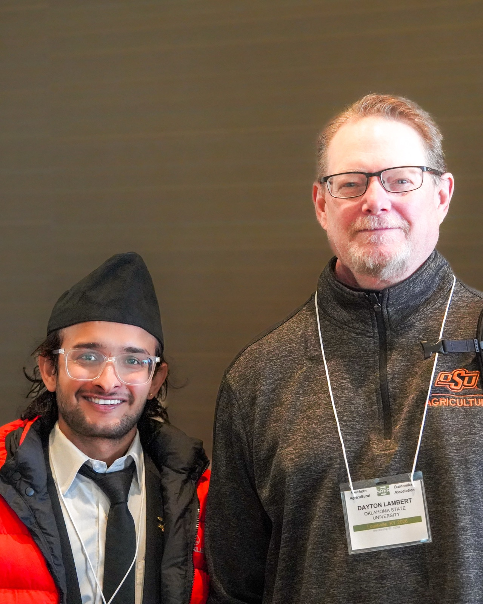
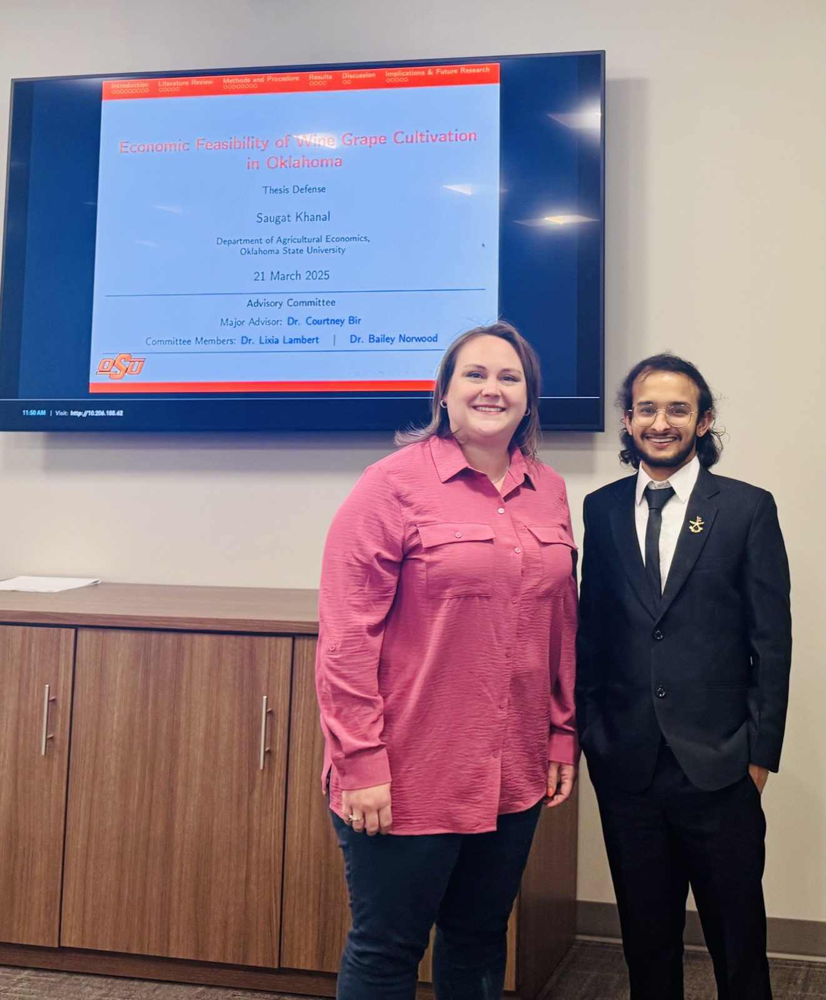
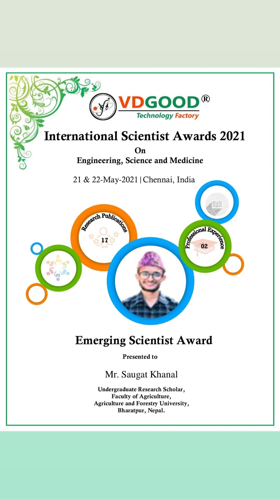

```{=html}
<div class="eyebrow">Advisors &amp; collaborators</div>
```

Two faculty members in the Department of Agricultural Economics at Oklahoma
State University have shaped this research program: Dr. Dayton Lambert at the
doctoral level, and Dr. Courtney Bir during the Master's degree.

```{=html}
<div class="person">
  <div>
    
    <div class="person__caption">With Dr. Dayton Lambert, SAEA Annual Meeting, Louisville, Kentucky, 2026.</div>
  </div>
  <div>
    <h2 class="person__name">Dr. Dayton Lambert</h2>
    <div class="person__role">Doctoral advisor &middot; Sparks Chair in Agricultural Sciences</div>
    <p>
      Khanal works under Dr. Dayton Lambert, Sparks Chair in Agricultural
      Sciences at Oklahoma State University, on a Hierarchical Spatial
      Errors-in-Variables Model (HSEVM) for crop yield estimation. The project
      jointly estimates kriged interpolation surfaces for climate variables
      alongside county-level yield regressions, using Bayesian inference through
      the Integrated Nested Laplace Approximation (INLA). Lambert has directed
      key modeling decisions on the project, including the use of county
      centroid polynomial coordinates as instruments to address the Modifiable
      Areal Unit Problem and spatial support misalignment between weather
      stations and county boundaries.
    </p>
  </div>
</div>
```

```{=html}
<div class="person">
  <div>
    
    <div class="person__caption">With Dr. Courtney Bir, Master's thesis defense, Oklahoma State University, March 2025.</div>
  </div>
  <div>
    <h2 class="person__name">Dr. Courtney Bir</h2>
    <div class="person__role">Master's advisor &middot; Associate Professor of Agricultural Economics</div>
    <p>
      During his Master's degree, Khanal worked under Dr. Courtney Bir,
      Associate Professor of Agricultural Economics at Oklahoma State
      University. His thesis examined the economic feasibility of wine grape and
      vine production in the Southern Great Plains region of Oklahoma,
      evaluating establishment costs, yield expectations, and breakeven
      economics for prospective growers. That work developed into the manuscript
      "Economic Feasibility of Wine Grape Cultivation in the Southern Great
      Plains," coauthored with Bir and Aaron Essary, currently under review at
      the <em>Journal of Agricultural and Applied Economics</em>.
    </p>
  </div>
</div>
```

```{=html}
<div class="section-head">
  <div class="eyebrow">Milestone</div>
  <h2>Master's degree conferred</h2>
</div>
```

```{=html}
<div class="gallery">
  
  
</div>
```

[Read the research](research.qmd) &nbsp;·&nbsp;
[Conferences](conferences.qmd)
