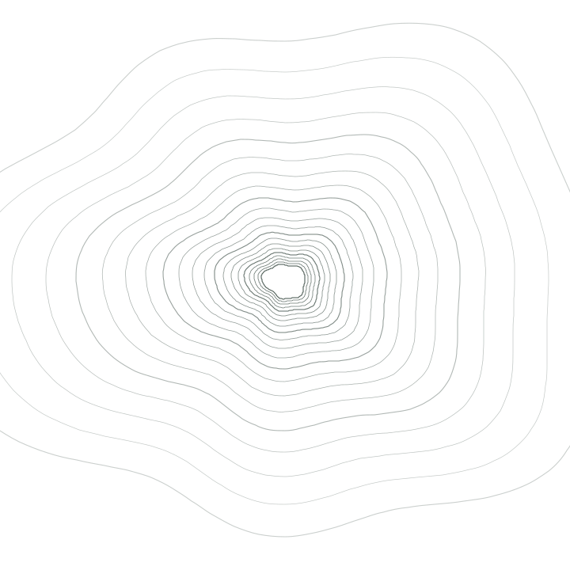

```{=html}
<section class="hero">
  <div class="hero__text">
    <div class="hero__role">Ph.D. Student &middot; Agricultural Economics</div>
    <h1 class="hero__name">Saugat Khanal</h1>
    <div class="hero__role">Oklahoma State University &middot; Stillwater, Oklahoma</div>
    <p class="hero__tagline">
      I study how measurement error in interpolated climate data biases
      crop-yield models, and build spatial errors-in-variables methods to
      correct for it. This work sits at the intersection of spatial
      econometrics and agricultural climate risk.
    </p>
  </div>
  <figure class="hero__figure">
    
    
    <figcaption class="station-marker">36.114&deg; N, 97.058&deg; W &mdash; STILLWATER</figcaption>
  </figure>
</section>
```

```{=html}
<div class="section-head">
  <div class="eyebrow">About</div>
  <h2>Interpolation error, and what it costs a yield model</h2>
</div>
```

Saugat Khanal is a Ph.D. student in Agricultural Economics at Oklahoma State
University. His research spans spatial econometrics, policy analysis,
time-series econometrics, and risk, uncertainty, and insurance programs. His
current work addresses interpolation-induced bias in the climate variables used
to estimate crop yield response, developing spatial errors-in-variables models
that correct for measurement error introduced when weather station data is
interpolated onto county-level administrative units. He holds an M.S. in
Agricultural Economics from Oklahoma State University and a B.Sc. in Agriculture
from the Agriculture and Forestry University, Rampur, Nepal.

[Read the research](research.qmd) &nbsp;·&nbsp;
[Publications](publications.qmd) &nbsp;·&nbsp;
[Curriculum vitae](cv.qmd)

```{=html}
<div class="section-head">
  <div class="eyebrow">Research focus</div>
  <h2>Four threads</h2>
</div>
```

```{=html}
<div class="method-grid">
  <div class="method">
    <span class="method__index">01</span>
    <h3 class="method__title">Spatial econometrics</h3>
    <p class="method__body">
      Hierarchical spatial errors-in-variables models, kriged interpolation
      surfaces, and the Modifiable Areal Unit Problem, estimated jointly through
      approximate Bayesian inference.
    </p>
  </div>
  <div class="method">
    <span class="method__index">02</span>
    <h3 class="method__title">Climate&ndash;yield modeling</h3>
    <p class="method__body">
      County-level corn yield response to growing degree days, killing degree
      days, and drought indices, with attention to how the climate data itself
      is constructed.
    </p>
  </div>
  <div class="method">
    <span class="method__index">03</span>
    <h3 class="method__title">Policy and time-series analysis</h3>
    <p class="method__body">
      Cointegration and error-correction modeling of macroeconomic
      relationships, including U.S. inward foreign direct investment under an
      ARDL framework.
    </p>
  </div>
  <div class="method">
    <span class="method__index">04</span>
    <h3 class="method__title">Risk, uncertainty, insurance</h3>
    <p class="method__body">
      Willingness to pay for agricultural insurance, rainfall index insurance
      design, and the basis risk that separates an index from a farmer's actual
      loss.
    </p>
  </div>
</div>
```

```{=html}
<div class="section-head">
  <div class="eyebrow">Currently</div>
  <h2>Working with</h2>
</div>
```

```{=html}
<ul class="facts">
  <li>
    <strong>Doctoral advisor</strong>
    <span>Dr. Dayton Lambert, Sparks Chair in Agricultural Sciences, Oklahoma
    State University. Hierarchical Spatial Errors-in-Variables Model (HSEVM)
    for crop yield estimation.</span>
  </li>
  <li>
    <strong>Master's advisor</strong>
    <span>Dr. Courtney Bir, Associate Professor of Agricultural Economics,
    Oklahoma State University. Economic feasibility of wine grape production in
    the Southern Great Plains.</span>
  </li>
  <li>
    <strong>Presented</strong>
    <span>SAEA 2026 Annual Meeting, Louisville, Kentucky. WAEA 2026 Annual
    Meeting, Flagstaff, Arizona.</span>
  </li>
  <li>
    <strong>Recognition</strong>
    <span>Williams Endowed Distinguished Graduate Fellowship, 2026. Stoecker
    Family International Agricultural Economics Scholarship, 2026.</span>
  </li>
</ul>
```

[Meet the advisors](advisors.qmd) &nbsp;·&nbsp;
[Conferences](conferences.qmd)
